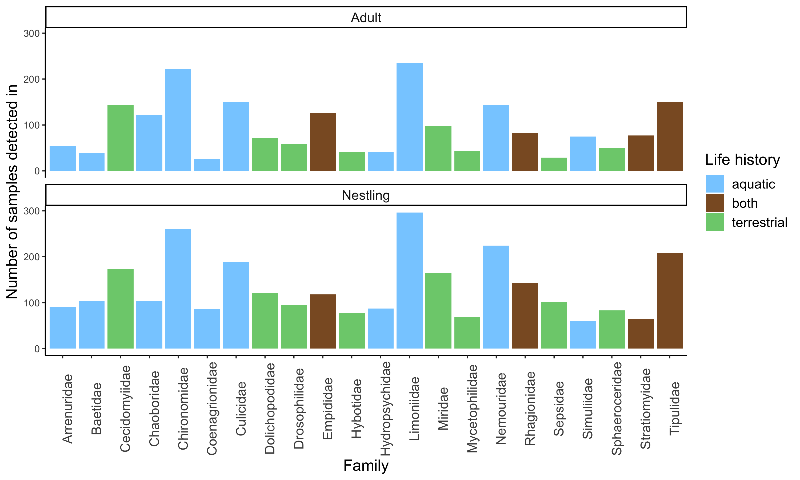
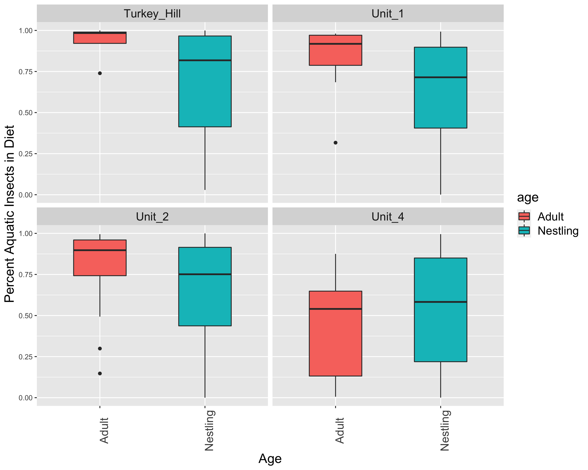

```{r setup, include=FALSE}
knitr::opts_chunk$set(echo = TRUE)
library(knitr)
library(dplyr)
library(ggplot2)
library(here)
library(sjPlot)
library(car)

getwd()
```

# Overview

This R Markdown document describes the data processing and analyses for our project examining diet patterns across tree swallow study sites in Tompkins County, NY. Specifically, it describes processing and working with COI data from tree swallow nestlings and adults using fecal samples collected in the field. The wet lab procedures are not described here. The data processing steps and code to produce initial exploratory figures are located in the script entitled "main_script.R," which is located in this repository.

# AMPtk Pipeline

All of the raw sequences for these samples were processed using the `AMPtk` pipeline in the command line [@amptk]. We followed very closely the workflow described on the project website `amptk.readthedocs.io/en/latest`. Before running `AMPtk` you need to install the software in a conda environment, install `USEARCH` and download the COI database. Those steps are described in detail on the website and not repeated here.

A few notes:
 
- It seems that currently there is no way to run AMPtk on Mac with OS Catalina because it can't execute the 32bit `USEARCH` program. Use an older computer, virtual machine, or cloud computing.
- The pipeline expects your sequences to be named: `sampleID_whatever_filler_R1/F1.fastq.gz`. The BRC sequences come back with the sample name in the middle. We haven't yet figured out how to make `AMPtk` recognize that, so we've just been batch-renaming the files to get the sample name first.

Once `AMPtk` is installed. The entire pipeline that we've run to this point involves just three commands (will take several hours on a home laptop to run with samples in hundreds). Output files will be saved in the folder where you have set up your conda environment.
 
1. Pre-processing sequence data. Takes a set prefix to add to all files and the forward and reverse primer sequences. Specify input folder where sequences are stored.

> `amptk illumina -i /directory/with/sequences -o trescoi` 
> `-f GCHCCHGAYATRGCHTTYCC -r TCDGGRTGNCCRAARAAYCA`

2. Denoising with `DADA2` [@dada2]. This takes in the processed sequences from step one and applies the denoising algorithm that identifies ASVs and models sequencing error to arrive at a final list of ASVs for F/R reads. Forward and reverse reads are then merged together.

> `amptk dada2 -i tres.coi.demux.fg.gz --platform illumina -o trescoi`

3. Assigning taxonomy. This uses the default suggestions from `AMPtk` documentation, but there are many other options. It applies the 'hybrid taxonomy algorithm', which looks at matches to i) Global Alignment to the downloaded COI arthropod database, ii) UTAX classification, and iii) SINTAX classification. More info is on the website, but basically it retains the best hit that also has the most levels of taxonomic ranks. The arthropod COI database needs to be downloaded and set up for this to run.

> `amptk taxonomy -i trescoi.cluster.otu_table.txt -f trescoi.cluster.otus.fa -d COI`

Those three commands produce a bunch of output files, but only three are needed to pull into `R` for subsequent analyses.

- **trescoi.cluster.otu_table.txt** has samples in columns and OTUs in rows with reads in each cell
- **trescoi.cluster.taxonomy.txt** has full taxonomic information for each OTU
- **trescoi.mapping_file.txt** has one row for each sample to add metadata

(Due to the large amount of time it takes to run the amptk pipeline, Conor ran two sets of sequencing run results separately through the pipeline. This resulted in two separate sets of files: one from sequencing run results received primarily in November 2020, and one from results received in December 2020. For now, there are two sets of the aforementioned files; they are delineated with "2020_11" or "2020_12." For example, the first file from the November run is named "trescoi_2020_11.cluster.otu_table.txt," and the first file from the December run is named "trescoi_2020_12.cluster.otu_table.txt.")

Those three files are read into the `R` script in this repository as the basis of everything here with the addition of sample metadata. The additional `AMPtk` files are saved in a folder with the repository but are not used further.

**NOTE:** There are many other optional steps in `AMPtk`. For example, one set of commands works to try to remove barcode bleed over where sequences from one barcode/sample are accidentally attributed to other samples. There are different types of classifiers and options, etc. What we've done here is (we think) the basic or bare-bones pipeline.

# Moving to R

The first part of the main script deals with importing those three `AMPtk` files and merging them into a single `phyloseq` object [@phyloseq]. There is a fair amount of wrangling that happens in the script, but it's really all just reformatting and merging things together into the format that `phyloseq` expects. It isn't necessary to use `phyloseq` for a lot of these things, but once the data is merged into that object it is very easy to work with all of their functions for subsetting, filtering, merging, plotting etc. The one thing that is not in here at the moment is a phylogenetic tree for the relationships between the food items. `phyloseq` will accept a tree also and that would allow for things like calculating unifrac & Faith's phylogenetic diversity or plotting diets on trees etc.
  
Before going any further, we pulled out only the samples relevant for this project, and we performed all subsequent filtering and analyses only on those samples. Those samples include:

1) **Adult samples collected in 2019**: These include samples collected from adults across all four sites (Unit 1, Unit 2, Unit 4, Turkey Hill).

2) **Nestling samples collected in 2019**: These include samples collected from nestlings across all four sites (Unit 1, Unit 2, Unit 4, Turkey Hill). At Unit 1 and Unit 2, the samples were collected on nestling days 12 and 15, and at Unit 4 and Turkey Hill, the samples were collected on nestling days 6 and 12.

4) **Gut passage time samples**: These are 25 samples total, taken from day 7 through 12 for five nestlings brought from the field into captivity in 2019. These fecal samples were taken during Jenn Houtz's experiment.
  
# Sequencing Depth

The first thing we will check is how many sequences we have per sample. This is showing the number of sequences retained for each sample *after* merging, denoising, whatever other filtering dada2 did, and removing everything except for Arthropods. So many of these samples did have quite a few more reads in the initial return. There are two reasons to look at the read counts. First, to see if samples 'worked' for getting data. Most of what we've heard from other people using these techniques is that they expect 5-15% of their samples to just fail to return reads for some reason (no dna, bad extraction, bad amplification, not enough sample added to sequencer, etc). We have been really loading our MiSeq runs with the max samples and they are trying to pool all 384 at even DNA concentrations, so we think it's not surprising that a fair number would fall out. The second reason to look at this is to decide if we might want to rarefy samples to an even depth of reads for some analyses. This could be especially important for comparing alpha diversity metrics.

Here is the log total number of reads per sample for all samples combine (log scale makes it easier to see the variation on the low end, which is what we care about). This plot includes wild adults, wild nestlings, and negative controls.
  
{width=90%}\  
  
There is a reference line showing where 150 reads falls. That is a pretty low number to rarefy to, but even there we lose a bunch of samples that are very low. It might be that in many of those samples all 150 reads are from the same single food item and in some of the higher read samples you still recover the full (or mostly full) community even with only 150 samples.

Here is the same plot with samples broken out by wild adults, wild nestlings, and negative controls.

{width=90%}\

It looks like all but one negative control has very low reads. One thing that we may need to think about is that even though these negative controls have low reads overall, they *do* have some reads that hit on arthropod and other sequences. It's unclear if that means that there was some cross contamination in the lab procedure, or if this is a result of the index-bleed that was mentioned above. We could try to get the `AMPtk` function running for index bleed or alternatively, we could try doing something like only counting a prey item as encountered if there are more than 50 (?) reads for that taxa within a sample. Eliot & Dave are currently using 50 reads as a cuttoff for their warbler diet data. Just as a quick check Conor looked at pruning to a certain number of reads for the negative control samples. If you only include taxa with >25 reads there are only 3 genera retained across all the negative controls, that might be a reasonable criteria.

# Sequencing Depth for Captive Nestlings

Here, we examine the captive nestling samples to see their distribution of total reads, and then their distribution of reads split across days.

This figure shows the distribution of reads with all captive samples considered together.

{width=90%}\

It looks like the total number of reads is definitely frequently above our 150 line.

This figure shows the distribution of reads split out by day.

{width=70%}\

We see that, except for day 6 when there is one sample that had a really high number of reads, there doesn't seem to be any pattern of decreasing reads across days. This is interesting because, once the birds were brought into captivity, they were fed sterile food that shouldn't have had any insects in it. However, Conor pointed out that this may be related to the fact that the PCR process amplifies whatever DNA is in there, so it may have just amplified the small amount of DNA that it "found."

# Filtering in Phyloseq 

The next steps in the R script are doing filtering steps using `phyloseq`.

- **Agglomerate Taxa**: Many ASVs don't have full species level identification. We can group together at the genus/family/order level to include those samples, or just to make it easier to interpret differences with fewer taxa. For this project, we are agglomerating to family because that is most relevant for identifying whether insects have aquatic or terrestrial larval stages.
- **Remove x-tons**: Removing singletons is very common. Some kind of sensitivity analysis removing 1-tons, 5-tons, 25-tons, etc. might be good. See issue described above for negative controls. For this project, we have so far removed 5-tons.
- **Transform to Relative Abundance**: For some analyses we'll want relative abundance rather than raw reads. The function is in the script. This should be done after rarefaction if using even depths.
- **Filter out rare taxa**: It's easy to do things like remove taxa <x% of all reads or <x% of reads within each sample or that appear in <x% of all samples. There are a few reasons to do this. First, it might be helpful for issues discussed above relating to clean up that could be sequencing mistakes, etc. Second, for looking at differential allocation of diet (e.g., to adults vs. nestlings) there is no power to detect differences for diet items that are very rare, so it may be better use of statistical power to focus just on common diet items for those analyses (e.g., genera that are found in >10 or >20% of all fecal samples, etc). For this project, we have filtered out taxa that < 1e-5 mean values for relative abundance.
- **Transform to Presence Absence**: Change relative abundance to 1/0 for each taxa.

# Identifying Aquatic and Terrestrial Families

Before working with figures and statistical analyses, we researched what we are referring to as the "life history" classifications of each family; that is, whether their larval stage is aquatic or terrestrial. Once we had all the arthropod families, we exported that list as a .csv file and did research on each individual family to determine whether its larval stage is aquatic or terrestrial. We then imported that file back in with those classifications and joined it with the rest of the dataset.

**Note:** For now, we are using aquatic/terrestrial classifications that were performed by Paige and Jenny. We are currently having Danielle look over these classifications and confirm that they are indeed accurate. There are some classifications that are currently listed as "both" or "unknown," and for now we do not consider those families "aquatic" in our analyses; when calculating "percent aquatic," we only use those families that are definitively aquatic. Notably, Tipulidae and Empididae are very common families that are currently classified as "both" and therefore not counted as "aquatic" in percentage calculations. We may want to rethink this later.

Here, for general exploration of the data, we plot families that occur in over 20% of all samples, and whether they are aquatic or terrestrial.

\

# Major questions for paper:

### Question 1: What do tree swallows eat in Tompkins County, New York?

We will need to discuss how to approach this question.

### Question 2: What predicts aquatic insect content in the diet?

For all analyses for question 2, we have left out males. It is worth discussing whether it makes sense to include males in these models or not (at least, for questions 2A and 2C). They do increase the sample size, but we just don't know as much about them.

Additionally, for all of these analyses, I have transformed the percentage data used as the response variable (i.e. percent aquatic) using the logit scale. This transformation, performed with the gtools package, looks like this: logit(percent_aquatic, min = -0.0001, max = 1.0001). This was at the suggestion of a statistical consultant from the Cornell Statistical Consulting Unit. Others have suggested using beta logistic regression, but there are no packages in R that are able to do that with 1) random effects, and 2) both 0s and 1s in the percent data.

#### Question A: Do age, site, or an interaction between the two predict aquatic insect content in diet?

Here, I have fit a linear mixed effects model with percent aquatic (logit transformed) as the predictor; age, site, age*site, and experimental treatment as fixed effects; and box as a random effect. We see that there is a strong effect of age and site on percent aquatic insects in diet. Additionally, there is a strong effect of the interaction between age and site (Unit 4).

````{=html}
```{r, echo=FALSE, results='asis'}
xfun::file_string('model_outputs/q2a_mod_tab.html')
```
````

\

#### Question B: Does a mother's CORT, mass, wing, and/or brood size predict the percent aquatic in the diet of her nestlings?

To do for this question: use brood size at time of sampling (currently using day 6 brood size)

For this question, we used a model selection approach. We again transformed "percent aquatic" using the logit transformation.

It was difficult to know which brood size to include as the samples are taken over the course of the provisioning period, during which nestling loss occurs. For simplicity, I chose to use Day 6 Brood Size, since it's an "average" of the provisioning period.

For CORT measurements, we only used baseline because we did not take stress bleeds from CU4/TH birds. I also excluded one nest with a mom that had a CORT outlier measurement (baseline was >30).

The AIC table is below.

```{r, echo = FALSE}
tab <- read.csv(here("3_r_scripts/model_outputs/AIC_Output_q2b.csv"))
tab_df(tab)

```

There are four top models. Their outputs are below:

````{=html}
```{r, echo=FALSE, results='asis'}
xfun::file_string('model_outputs/q2b_mod1_tab.html')
```
````


````{=html}
```{r, echo=FALSE, results='asis'}
xfun::file_string('model_outputs/q2b_mod2_tab.html')
```
````


````{=html}
```{r, echo=FALSE, results='asis'}
xfun::file_string('model_outputs/q2b_mod3_tab.html')
```
````
````{=html}
```{r, echo=FALSE, results='asis'}
xfun::file_string('model_outputs/q2b_mod4_tab.html')
```
````

In each of these models, site is close to or is a significant predictor of nestling diet. None of the other variables are important predictors.

{width=60%}\

#### Question C: Does a female's CORT, mass, and/or wing predict the percent aquatic in her diet?

To do: add in separate analysis with day 6 samples and nest-level fate.

For this question, we again used a model selection approach, and transformed "percent aquatic" using the logit transformation.

For CORT measurements, we only used baseline again because we did not take stress bleeds from CU4/TH birds at the third captures. I also excluded two individuals who had baseline CORT measurements of over 30. Also, because we're using a model selection approach, I removed all birds without baseline CORT measurements. No birds were missing mass or wing measurements. Note that for wing, I took the first wing measurement that was taken on every bird. This is because some birds were not measured a second or third time when they were re-captured.

The AIC table is below.

```{r, echo = FALSE}
tab <- read.csv(here("3_r_scripts/model_outputs/AIC_Output_q2c.csv"))
tab_df(tab)

```

There are two top models. Their outputs are below:

````{=html}
```{r, echo=FALSE, results='asis'}
xfun::file_string('model_outputs/q2c_mod1_tab.html')
```
````


````{=html}
```{r, echo=FALSE, results='asis'}
xfun::file_string('model_outputs/q2c_mod2_tab.html')
```
````

In the top model, both mass and unit are significant predictors of percent aquatic in adult females' diets. In the second model, ranked closely behind, unit is a significant predictor of percent aquatic, and wing is close to significant.

{width=60%}\

{width=60%}\

I had to plot the mass figure on the logit scale to actually see the positive relationship here. Not really sure what to make of this!

{width=60%}\


### Question 3: Does aquatic insect content affect nestling morphology?

Here, I have fit a linear mixed effects model with nestling mass as the predictor; percent aquatic, site, and percent aquatic*siteas fixed effects; and box as a random effect. There are no significant predictors.

````{=html}
```{r, echo=FALSE, results='asis'}
xfun::file_string('model_outputs/q3_mod_tab.html')
```
````


### Literature Cited
